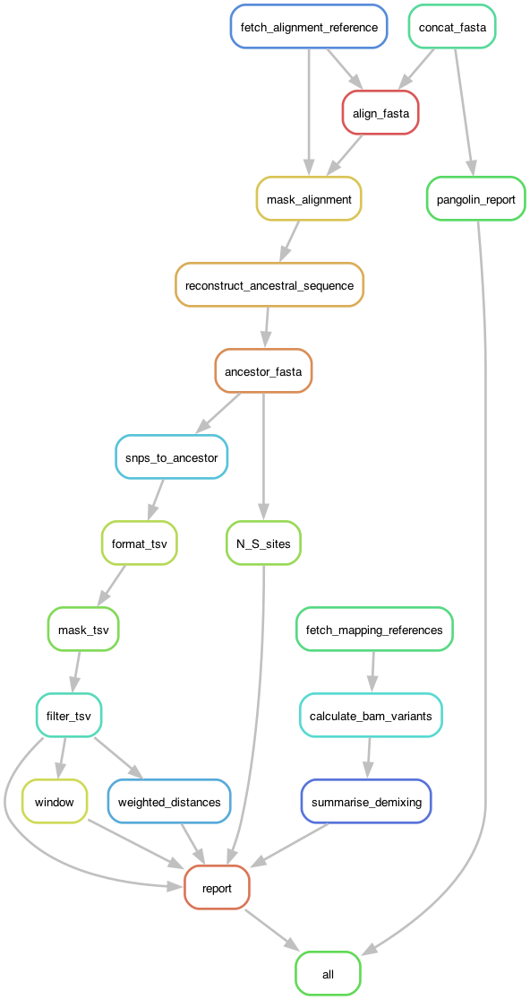
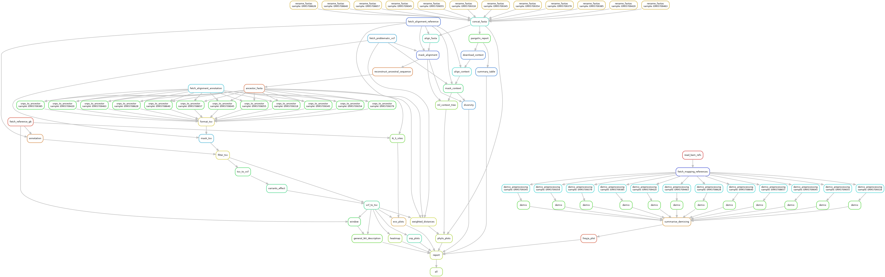

# Case-study-SARS-CoV-2


[](https://snakemake.readthedocs.io)

## Instructions

To run the pipeline, you will need an environment with `snakemake`
(check [the Snakemake docs](https://snakemake.readthedocs.io/en/stable/getting_started/installation.html)).

Then, modify the [target configuration file](config/targets.yaml)
to point to your data. It should look like this:

```yaml
SAMPLES:
  sample1:
    bam: "path/to/sorted/bam1.bam"
    fasta: "path/to/sequence1.fasta"
  sample2:
    bam: "path/to/sorted/bam2.bam"
    fasta: "path/to/sequence2.fasta"
  ...
METADATA:
  "path/to/metadata.csv"
OUTPUT_DIRECTORY:
  "output"
CONTEXT_FASTA:
  null
MAPPING_REFERENCES_FASTA:
  null
```

You may also provide these information through the `--config` parameter.

Setting `CONTEXT_FASTA` to `null` will enable the automatic download of sequences
from the GISAID SARS-CoV-2 database
(see [the following section](README.md#context-checkpoints) for further details).
To enable this, you must provide your GISAID credentials by creating and
filling an additional configuration file `config/gisaid.yaml` as follows:

```yaml
USERNAME: "your-username"
PASSWORD: "your-password"
```

Setting `MAPPING_REFERENCES_FASTA` will enable the automatic download of the
reference sequence(s) that were used to map the reads and generate the BAM files.
If the required sequence is not available publically or you already have it
at your disposal, it may be provided manually by setting the parameter to the
path of the reference FASTA file.

To run the analysis with the default configuration, just run the following command
(change the `-c/--cores` argument to use a different number of CPUs):

```shell
snakemake --use-conda -c8
```

To run the analysis in an HPC environment using SLURM, we provide a
[default profile configuration](profile/default/config.yaml) that adapt
to your needs or directly use of by running the following command:

```shell
snakemake --slurm --use-conda --profile profile/default
```

## Context checkpoints

By default, a dataset of samples that meet the spatial
and temporal criteria set through the [`download_context` rule](workflow/rules/context.smk):

- Location matching the place(s) of sampling of the target samples
- Collection date within the time window that includes 95% of the date distribution of the
target samples (2.5% is trimmed at each end to account for extreme values) ± 2 weeks

Then, a series of checkpoints are enforced:

- Remove context samples whose GISAID ID match any of the target samples
- Enforce a minimum number of samples to have at least as many possible combinations as bootstrap replicates for the diversity assessment (set in [the configuration file](config/config.yaml))

If these requirements are not met, a custom sequence dataset must be
provided through the `CONTEXT_FASTA` parameter by editing [the target configuration file](config/targets.yaml)
or via the command line:

```shell
snakemake --config CONTEXT_FASTA="path/to/fasta"
```

## Workflow graphs

To generate a simplified rule graph, run:

```shell
snakemake --rulegraph | dot -Tpng > .rulegraph.png
```



To generate the directed acyclic graph (DAG) of all rules
to be executed, run:

```shell
snakemake --forceall --dag | dot -Tpng > .dag.png
```




## Methodology

### Pairwise distances between samples

In order to describe in a better way the relationship between samples, distances beween them are calculated tacking into account allele frequencies in sequencing data. Our aproach to compute the distance between sets of allele frequencies is based on FST formula and define the distance between two samples as:

```math
d(M,N)=\sum\limits_{i=1}^I \frac {\sum\limits_{j=1}^J (M_{ij} -N_{ij})^2 } {4 - \sum\limits_{j=1}^J (M_{ij} +N_{ij})^2 }
```

where:

$M$ y $N$: Two sequences.

$i = 1... I :$ Index over polymorphic sites.

$j = 1... J :$ Index over alleles.

$M_{ij}$ : Frequency of allel $j$ in position $i$ for sequence $M$.


