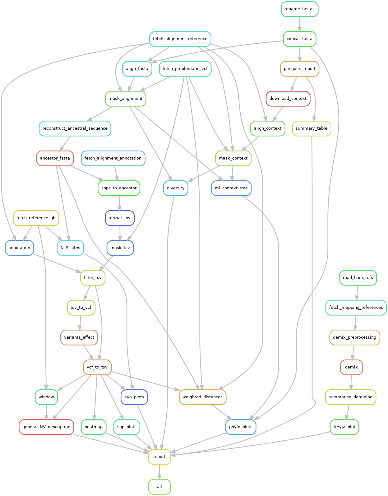

# Case-study-SARS-CoV-2



## Instructions

To run the pipeline, first fetch the data (you may need to modify the script to include your credentials):

```bash
./fetch_data.sh
```

Then, within an environment with `snakemake>6.0` (see [the Snakemake docs](https://snakemake.readthedocs.io/en/stable/getting_started/installation.html)), run the following:

```bash
snakemake --use-conda -c8
```

You may change the `-c` argument to use a different number of CPUs.

## Manually adding a context

A custom sequence dataset can be provided through the `CONTEXT_FASTA` parameter
by editing `config/targets.yaml` or via the command line:

```bash
with --config CONTEXT_FASTA="path/to/fasta"
```

## Generating a rule graph

```bash
snakemake --rulegraph | dot -Tpng > .rulegraph.png
```
