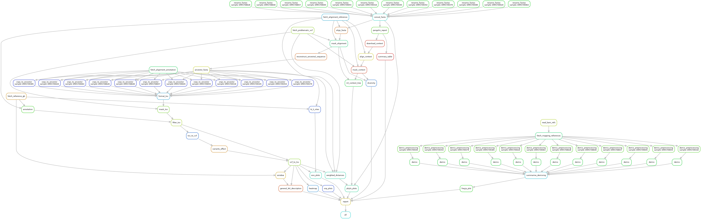

# Case-study-SARS-CoV-2


## Instructions

To run the pipeline, first fetch the data (you may need to modify the script to include your credentials):

```bash
./fetch_data.sh
```

Then, within an environment with `snakemake>6.0`
(see [the Snakemake docs](https://snakemake.readthedocs.io/en/stable/getting_started/installation.html)),
run the following:

```bash
snakemake --use-conda -c8
```

You may change the `-c/--cores` argument to use a different number of CPUs.

## Context checkpoints

By default, a dataset of samples matching the location and time window
of the target samples will be fetched from the GISAID database

By default, the pipeline starts by selecting samples that meet the spatial
and temporal criteria (see the [`download_context`](workflow/rules/context.smk)
rule for reference):

- Location matching the place(s) of sampling of the target samples
- Collection date within the time window that includes 95% of the date distribution of the
target samples (2.5% is trimmed at each end to account for extreme values) ± 2 weeks

Then, a series of checkpoints are enforced:

- Remove context samples whose GISAID ID match any of the target samples
- Enforce a minimum number of samples to have at least as many possible combinations as bootstrap replicates for the diversity assessment (set in [the configuration file](config/config.yaml))

If these requirements are not met, a custom sequence dataset must be
provided through the `CONTEXT_FASTA` parameter by editing [the target configuration file](config/targets.yaml)
or via the command line:

```bash
snakemake --config CONTEXT_FASTA="path/to/fasta"
```

## Workflow graphs

To generate a simplified rule graph, run:

```bash
snakemake --rulegraph | dot -Tpng > .rulegraph.png
```


To generate the directed acyclic graph (DAG) of all rules
to be executed, run:

```bash
snakemake --forceall --dag | dot -Tpng > .dag.png
```


